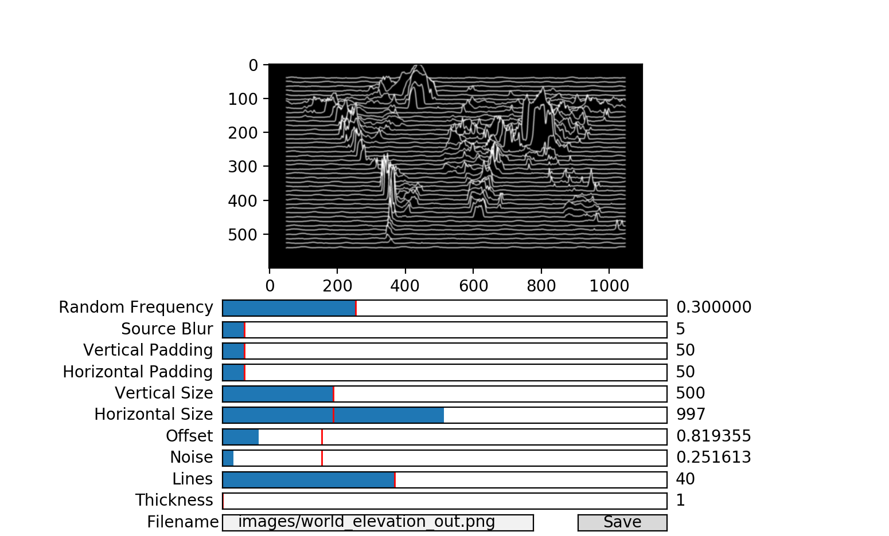
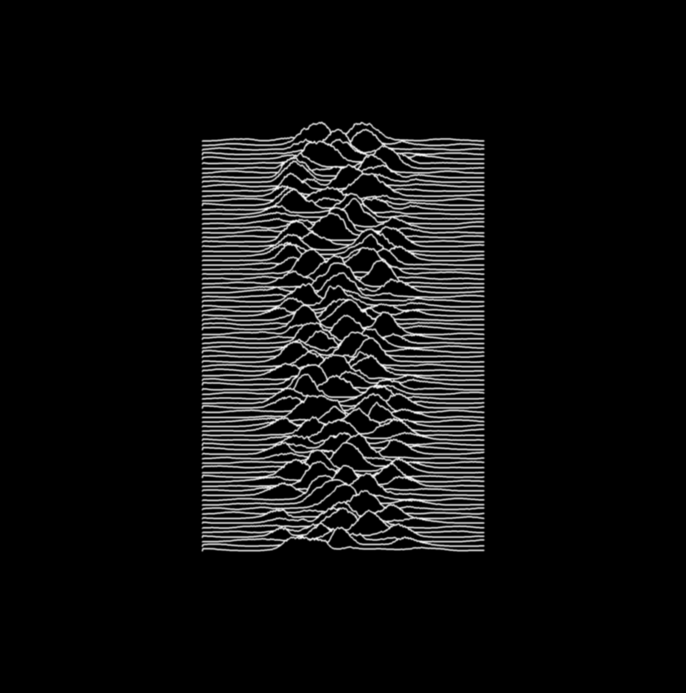
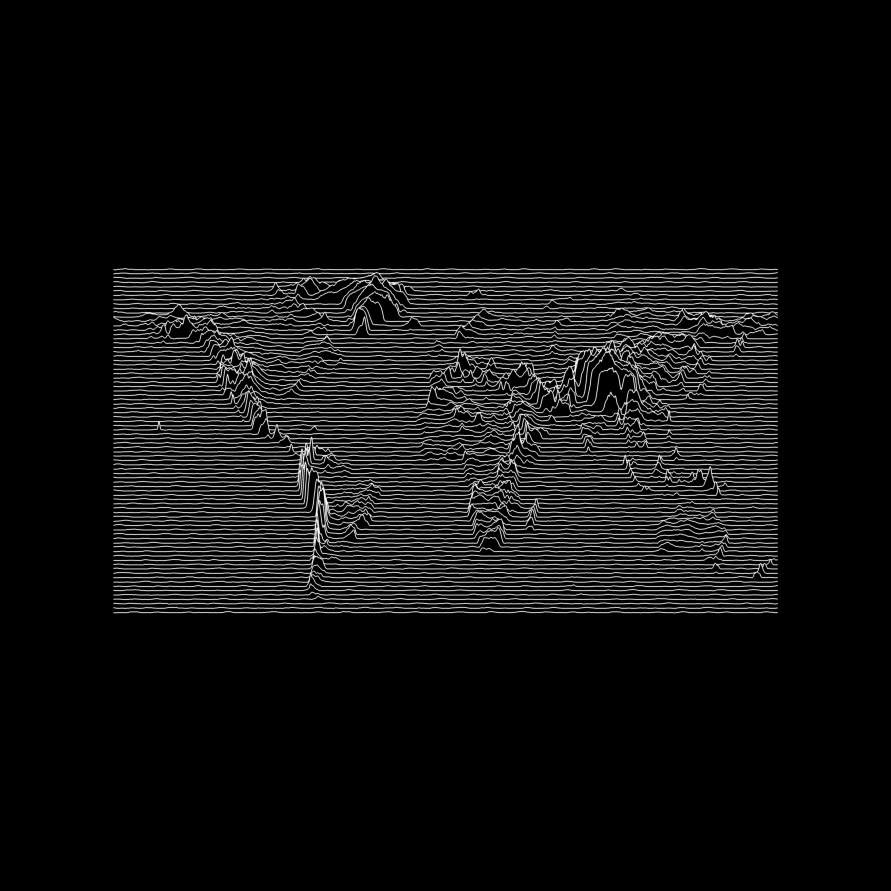
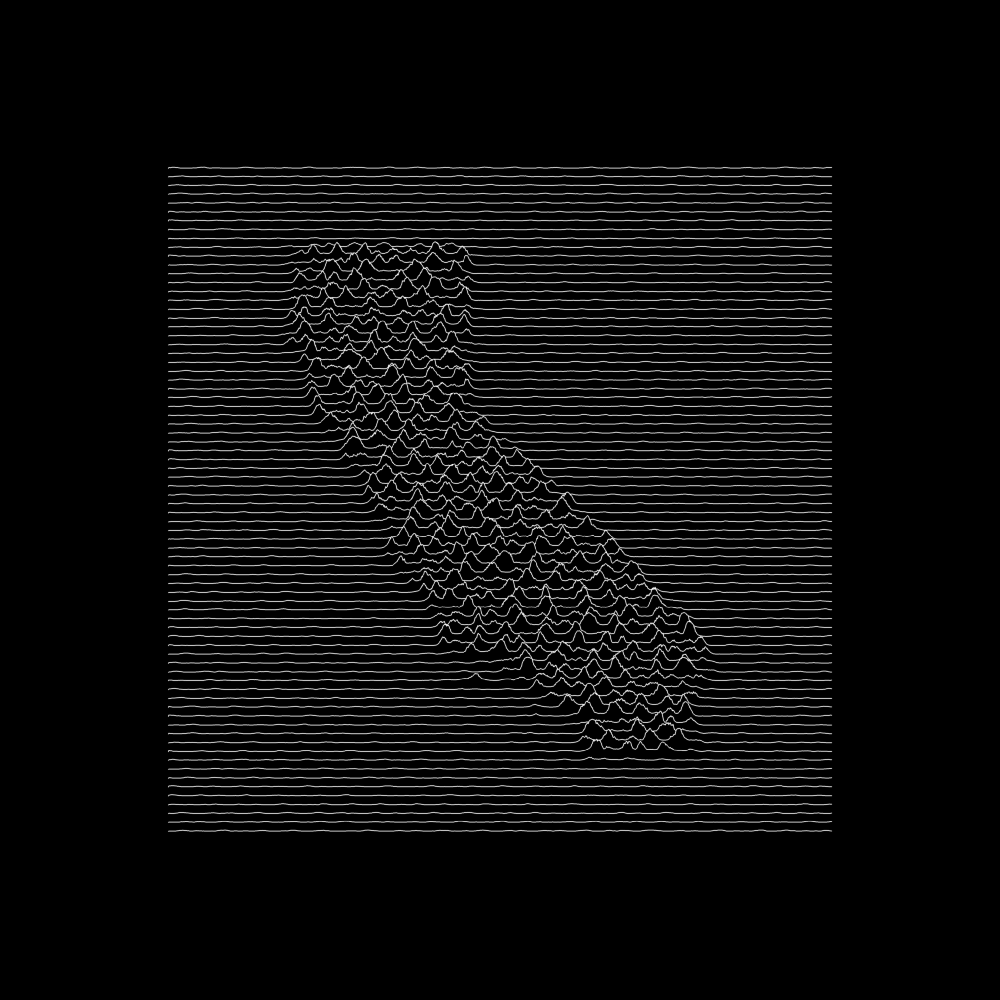

# Unknown Pleasures

This Python script takes in a heightmap image and turns it into an Unknown Pleasures album art style image. There are a bunch of sliders to adjust the output to your liking. I got some inspiration from [garrettdreyfus](https://github.com/garrettdreyfus)'s [project](https://garrettdreyfus.github.io/unknownpleasures/), but I really wanted a result that more accurately represented the original art style.

# Example Output

A recreation of the original cover:

And the corresponding input heightmap (I also messed with the sliders a bunch):

A map of the world with elevation:

California with random noise:

